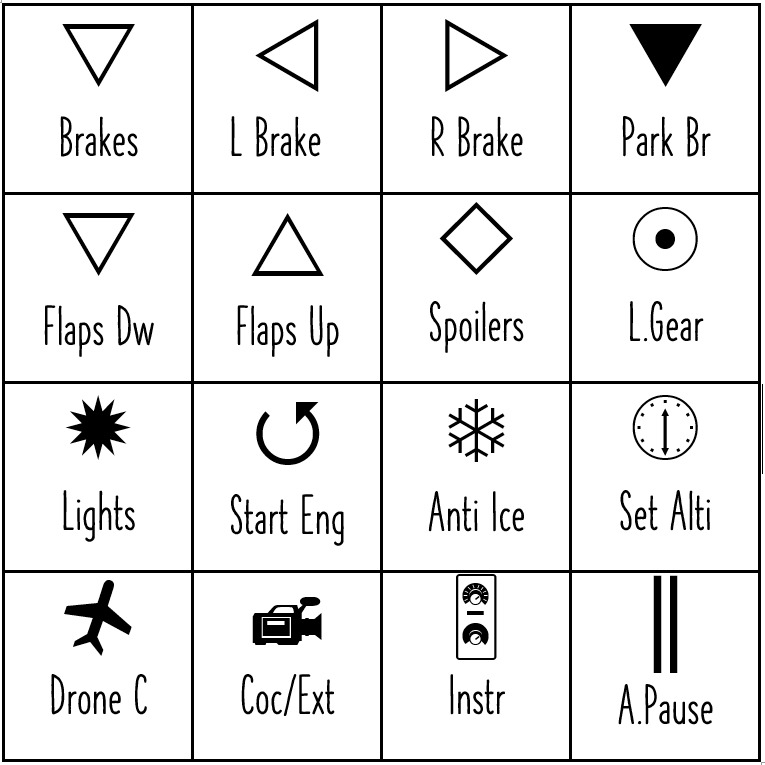

# 4b4keyboard
Custom 4x4 keyboard for use with FS2020 or other apps

HW needed :

RobotDyn 4x4 keyboard
AtMega32u4 based Micro Arduino or clone
3 wires
soldering iron

STL for top part of box is located on https://www.thingiverse.com/thing:3011284

Ino file needs to be compiled and uploaded into Arduino via Arduino IDE

Wiring is simple :

Buttons could be created simply in Word or other editor and then printed in right size to fit buttons. 
Example set is here :

FS2020 mapping :

Keyboard generate keystrokes LEFT SHIFT + RIGHT SHIFT + a..p so you can map them on any functions in your sim, not just what I used for my
